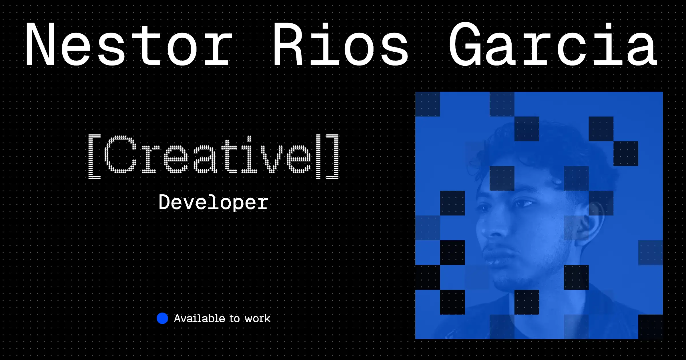

# Nestorrig _Award-winning Independent Creative Developer_

Hi, I'm Nestor Rios, an award-winning **Independent Creative Developer** based in Mexico City, working worldwide. I'm passionate about blending design, animation, and technology to craft **interactive web experiences** that connect people and brands.

I collaborate with brands, studios, and organizations looking to stand out in the digital space through visually engaging and technically robust projects.

I love open source and community-driven projects, I like to share my personal projects and experiments, so you can find right here on my [GitHub](https://github.com/nestorrig) or on [CodePen](https://codepen.io/nestorrig).

I'm flexible with tools, but I often reach for React, Next.js, and Astro; Three.js, R3F, GSAP, and Cinema 4D for 3D and motion; Storyblok or Sanity for content; and Netlify or Vercel to ship.

Some of my work has been recognized with:

- **GSAP Site of the Day** for [Hypefluency](https://www.linkedin.com/feed/update/urn:li:ugcPost:7462359013830291456/) and [AWE MX](https://www.linkedin.com/feed/update/urn:li:ugcPost:7381163585630158849/).
- **Awwwards Honorable Mention** for [Arcca Group](https://www.awwwards.com/sites/arcca-group).
- **Three.js Journey Challenge Winner** for [Magic Wand](https://threejs-journey.com/challenges/013-magic-spells).

### Education

On the other hand, I'm studying a Bachelor of Creative Computing at [CENTRO | Diseño, Cine y Televisión](https://centro.edu.mx/) in Mexico City. There I'm learning new tools and processes to expand my skills and knowledge.

### Portfolio

You can find my portfolio [here](https://nestorrig.github.io/nestorrig). Curious about how it's built? Read the [technical notes](./doc.md).

---

[LinkedIn](https://www.linkedin.com/in/nestorrig/) | [Behance](https://www.behance.net/nestorrig) | [Instagram](https://www.instagram.com/nestorrig/) | [Twitter](https://x.com/nestorrig) | [Awwwards](https://www.awwwards.com/nestorrig/) | [Mail](mailto:nestorrigs@gmail.com) | [Codepen](https://codepen.io/nestorrig)
