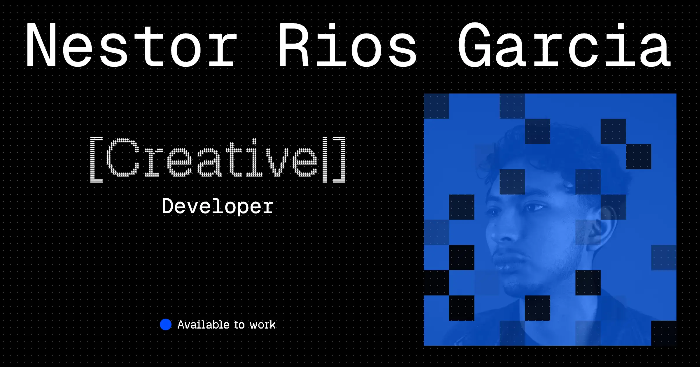

# How this portfolio is built



Technical and visual notes for the Nestorrig portfolio: structure, design decisions, how each section works, and the licensing of the repository.

## Overview

A single-page portfolio built with plain **HTML, CSS, and vanilla JavaScript**. There is no framework, bundler, or build step: the files in the repo are the files that get served.

Almost everything is done in CSS (layout, typing effects, masks, hover animations). JavaScript is only used for the demo reel player.

## Run locally

Serve the folder with any static server and open the printed URL:

```bash
npx serve .
```

## Project structure

```
.
├── index.html          # The portfolio
├── cover.html          # Page used to design and export the social cover image
├── css/
│   ├── style.css       # All site styles
│   └── fonts.css       # @font-face declarations for Geist, Geist Mono and Geist Pixel
├── js/
│   └── main.js         # Demo reel player
├── fonts/              # Geist font files + OFL.txt
└── assets/
    ├── img/
    │   ├── favicon/    # Favicons, touch icons and site.webmanifest
    │   ├── projects/   # Project card images (1280×720)
    │   ├── labs/       # Lab card images (1280×720)
    │   └── cover.png   # Social cover (1200×630)
    └── video/          # Demo reels
```

## Visual design

### Palette

Three colors, defined as CSS custom properties in `:root`:

| Token | Value | Use |
| --- | --- | --- |
| `--background-color` | `#000` | Page background |
| `--color-text` | `#FFF` | Text, borders, hover backgrounds |
| `--accent-color` | `#004bff` | Quotes, highlights, hover text, status dot |

Hover states invert the palette: white background with blue text. The same inversion is used for text selection and keyboard focus, so every interactive state feels like part of one system.

### Typography

- **Geist Mono** is the base font for all body text, which gives the site its terminal / code feel.
- **Geist Pixel** (Square, Circle, Triangle, Grid, Line) is used for accents: section titles, the status label, the brackets, and each word of the rotating roles, which uses a different pixel variant.
- `html { font-size: 10px }`, so `1rem = 10px` and sizes are easy to read (`1.6rem = 16px`).

### Pixel language

The pixel idea runs through the whole site:

- A tiled SVG crosshair pattern as the page background.
- The portrait is revealed through a grid mask of 80×80 squares.
- All icons (social links, Visit, Code source, play, sound, fullscreen) are hand-drawn pixel SVGs on a 12×12 grid, using `currentColor` so they follow the text color on hover.

## Sections

### Header

Name, role, and social links. Each link is split into one `<span>` per letter, and on hover the letters flicker in sequence.

### Hero

- **Rotating roles.** `[Frontend | Motion | Creative | WebGL | Interactive] - Developer` is typed letter by letter with a blinking cursor, entirely in CSS. Each word gets a time slot (`--slot-duration`) inside a shared cycle, and each letter is delayed by its position.
- **Portrait mask.** An SVG `<mask>` made of black squares sits over the photo. Each square animates its fill between black and white with a different delay, so the portrait keeps dissolving and rebuilding in pixels.
- **Quotes.** Six blue cards that float slowly around the portrait on tablet and desktop, and stack as a list on mobile (with an "About" title only on mobile). On hover, the borders pull inward and the highlighted words invert and flicker.

### Projects and Labs

Cards on a CSS grid: image on top, name below, and links on the right.

- **Projects:** 1 column on mobile, 2 from 768px. Kept at 2 on desktop so the client work stands out.
- **Labs:** 1, 2, and 3 columns. Each lab also links to its source code.
- Link labels ("Visit", "Code source") use the same letter-by-letter hover as the header.

### Demo reel

A custom video player built on top of a native `<video>`:

- Autoplays muted and loops when it scrolls into view (`IntersectionObserver`), and pauses when it leaves.
- Play / pause, sound toggle, and fullscreen buttons styled like the card links.
- A timeline built with `<input type="range">`, filled through a `--progress` custom property updated from JavaScript.
- Fullscreen is applied to the whole player (not just the video), so the custom controls stay visible.

### Footer

Pixel icons for Instagram, LinkedIn, X, GitHub, and Behance, following the same order as the header.

## Technical details

### Modern CSS in use

- **`sibling-index()` and `sibling-count()`** drive every staggered animation (typing, letter flicker, mask squares, floating quotes) without hard-coding a delay per element. These are recent CSS functions: in browsers that don't support them yet, the animations still run but without the stagger.
- **Container query units (`cqw`)** in `cover.html`, so the text scales with the cover itself instead of the viewport.
- **`aspect-ratio` + `min()`** to keep the cover at an exact ratio inside the viewport: `height: min(100dvh - 4rem, (100vw - 4rem) / 1.61)`.
- **`dvh`** instead of `vh` so mobile browser bars don't cut the layout.

### Responsive breakpoints

| Breakpoint | Changes |
| --- | --- |
| Base (mobile) | Single column, quotes as a list, "About" title visible |
| `min-width: 768px` | Floating quotes, 2-column grids, header links in one row |
| `min-width: 1200px` | Larger quotes, 3-column labs, 160px spacing between sections |

Hover effects live inside `@media (hover: hover) and (pointer: fine)`, so touch devices don't get stuck hover states. On touch screens the highlighted words in the quotes are shown inverted by default instead.

### Accessibility

- **Readable names.** Text split into per-letter spans is hidden from screen readers (`aria-hidden`), and each link or button gets a proper `aria-label` (for example "Visit Hypefluency" or "Code source of Magic Wand"). Decorative SVGs are hidden too.
- **Keyboard focus.** Links and buttons show the same inverted style as hover, plus a blue outline, when focused with the keyboard.
- **Demo reel shortcuts.** Active while focus is inside the player, so they never hijack page scrolling:

  | Key | Action |
  | --- | --- |
  | Space / K | Play / pause |
  | M | Sound on / off |
  | F | Fullscreen |
  | ← / → | Back / forward 5s |
  | J / L | Back / forward 10s |
  | 0–9 | Jump to 0–90% |
  | Home / End | Start / end |

- **Announcements.** Player actions are announced through an `aria-live` region, and the timeline exposes its value as "00:12 of 00:59".
- **Reduced motion.** If the user prefers reduced motion, the reel does not autoplay.

### Performance

- Card images are WebP at 1280×720 with `loading="lazy"` and explicit `width` / `height` to avoid layout shift.
- The reel uses `preload="metadata"` and only plays while visible.
- No external dependencies or requests: fonts are self-hosted.

### SEO and social sharing

- `index.html` includes description, canonical URL, Open Graph, and Twitter Card tags, using `assets/img/cover.png` (1200×630, PNG for compatibility with LinkedIn and other platforms).
- `cover.html` has the same tags adapted to the cover page, with `noindex` and a canonical pointing to the main page so it doesn't compete with it in search results.
- `site.webmanifest` sets the app name and black theme color when the site is installed on a phone.

### The cover page

`cover.html` reuses the hero markup and `style.css` to compose the social cover. It has three layouts:

- **Mobile:** stacked hero.
- **Tablet:** 4:5 portrait format.
- **Desktop:** 1.61:1 landscape format (the ratio of 1200×630 social images), laid out with CSS Grid.

Open it in the browser at the size you need and take a screenshot to export the cover.

## License

The repository has mixed licensing:

- **Source code** (HTML, CSS, and JavaScript) is released under the [MIT License](./LICENSE). You can reuse, modify, and learn from it freely.
- **Media in `assets/`** (photos, portraits, videos, demo reels, covers, favicons, and project screenshots) is **all rights reserved**. These files can't be copied, modified, redistributed, or used in other projects without written permission. Some screenshots show work made for third-party clients; their names, logos, and visual identities belong to their respective owners and are shown for portfolio purposes only.
- **Fonts in `fonts/`** (Geist, Geist Mono, and Geist Pixel) are distributed under the [SIL Open Font License 1.1](./fonts/OFL.txt).

The full terms are in [`LICENSE`](./LICENSE).
